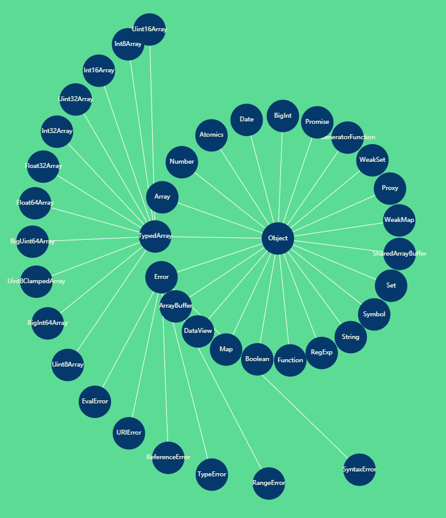

# Week3 学习笔记

- [Week3 学习笔记](#week3-%e5%ad%a6%e4%b9%a0%e7%ac%94%e8%ae%b0)
  - [JS 表达式 | 运算符和表达式](#js-%e8%a1%a8%e8%be%be%e5%bc%8f--%e8%bf%90%e7%ae%97%e7%ac%a6%e5%92%8c%e8%a1%a8%e8%be%be%e5%bc%8f)
    - [Tree vs Priority](#tree-vs-priority)
      - [Reference 类型](#reference-%e7%b1%bb%e5%9e%8b)
      - [Left Handside & Right Handside](#left-handside--right-handside)
  - [JS 表达式 | 类型转换](#js-%e8%a1%a8%e8%be%be%e5%bc%8f--%e7%b1%bb%e5%9e%8b%e8%bd%ac%e6%8d%a2)
    - [Unboxing - Object to primitive](#unboxing---object-to-primitive)
    - [Boxing](#boxing)
  - [JS 语句 | 运行时相关概念](#js-%e8%af%ad%e5%8f%a5--%e8%bf%90%e8%a1%8c%e6%97%b6%e7%9b%b8%e5%85%b3%e6%a6%82%e5%bf%b5)
    - [Statement](#statement)
      - [Completion Record](#completion-record)
  - [JS 语句 | 简单语句和复合语句](#js-%e8%af%ad%e5%8f%a5--%e7%ae%80%e5%8d%95%e8%af%ad%e5%8f%a5%e5%92%8c%e5%a4%8d%e5%90%88%e8%af%ad%e5%8f%a5)
    - [简单语句](#%e7%ae%80%e5%8d%95%e8%af%ad%e5%8f%a5)
    - [复合语句](#%e5%a4%8d%e5%90%88%e8%af%ad%e5%8f%a5)
  - [JS 语句 | 声明](#js-%e8%af%ad%e5%8f%a5--%e5%a3%b0%e6%98%8e)
    - [宏任务 / 微任务](#%e5%ae%8f%e4%bb%bb%e5%8a%a1--%e5%be%ae%e4%bb%bb%e5%8a%a1)
    - [事件循环](#%e4%ba%8b%e4%bb%b6%e5%be%aa%e7%8e%af)
  - [JS 结构化 | JS 函数调用](#js-%e7%bb%93%e6%9e%84%e5%8c%96--js-%e5%87%bd%e6%95%b0%e8%b0%83%e7%94%a8)
    - [执行栈：保存执行上下文](#%e6%89%a7%e8%a1%8c%e6%a0%88%e4%bf%9d%e5%ad%98%e6%89%a7%e8%a1%8c%e4%b8%8a%e4%b8%8b%e6%96%87)
      - [执行上下文](#%e6%89%a7%e8%a1%8c%e4%b8%8a%e4%b8%8b%e6%96%87)
      - [LexicalEnvironment](#lexicalenvironment)
      - [VariableEnvironment](#variableenvironment)
      - [Environment Record](#environment-record)
      - [Closure](#closure)
    - [Realm](#realm)
      - [ECMA Specs](#ecma-specs)
      - [StackOverflow Explaination](#stackoverflow-explaination)
      - [Intrisic Objects](#intrisic-objects)
      - [截图](#%e6%88%aa%e5%9b%be)

## JS 表达式 | 运算符和表达式

### Tree vs Priority

产生式来表示运算符优先级

1. Member
   - a.b - 成员访问
   - a[b] - 成员访问：支持变量
   - foo`string`
   - super.b
   - new.target
   - new Foo() - 带括号的 new 优先级更高
2. New
   - new Foo
3. Call
   - foo()
   - super()
   - foo()['b']
   - foo().b 点运算降级

example:

- new a()() = (new a())()
- new new a() = new (new a())
- new a()['b'] = (new a())['b']

#### Reference 类型

- Object / key
- assign / delete

#### Left Handside & Right Handside

example:

- a.b = c 正确
- a + b = c 错误

> 只有 left handside expression 可以放到等号左边，也是定义

- Update
  - a++
  - a--
  - --a
  - ++a

example：++ a ++ = ++(a++)

- Unary

  - delete a.b
  - void foo() - 把后边不管是什么都变成 undefined
  - typeof a
  - +a / -a
  - ~a - 按位取反，如果不是整数则强制转为整数
  - !a - !!a 把一个任何类型的数强制转换 Boolean 类型
  - await a

- Exponental
  - \*\* 唯一一个右结合

example: 3 \*\* 2 \*\* 3 = 3 \*\* (2 \*\* 3)

- Multiplicative
  - \* / %
- Additive
  - \+ -
- Shift
  - <<, >>, >>>
- Relationship

  - <, >, <=, >=, instanceof, in

- Equality

  - == / != - 类型不同，优先把 Boolean 类型转换为 Number 类型
  - === / !==

- Bitwise

  - & ^ | -

- Logical

  - && - &&前面是 false，后面不会执行
  - || - ||前面是 true，后面不会执行

- Conditional
  - ?: - 唯一一个三元运算符

---

## JS 表达式 | 类型转换

- a + b
- "false" == false
- a[o] = 1

### Unboxing - Object to primitive

- ToPrimitive
- toString vs valueOf
- Symbol.toPrimitive

### Boxing

| Type    | Object                  | Value       |
| ------- | ----------------------- | ----------- |
| Number  | new Number(1)           | 1           |
| String  | new String("a")         | "a"         |
| Boolean | new Boolean(true)       | true        |
| Symbol  | new Object(Symbol("a")) | Symbol("a") |

- . 或 [] 导致自动装箱

```javascript
/**
 * This function takes as input a number string in differnt radix
 * and convert it to Number
 * If the input is not a string, it will return 0
 * @param {String} str String to be converted to Number
 * @return {Number}
 */
function stringToNumber(str) {
  if (str.length < 2) {
    let parsed = parseInt(str)
    return isNaN(parsed) ? 0 : parsed
  }

  const radix = str[1]
  const numberPart = str.slice(2)
  let parsed

  if (radix === 'b') parsed = parseInt(numberPart, 2)
  else if (radix === 'o') parsed = parseInt(numberPart, 8)
  else if (radix === 'd') parsed = parseInt(numberPart, 10)
  else if (radix === 'x') parsed = parseInt(numberPart, 16)
  else parsed = parseInt(str)

  if (isNaN(parsed)) return 0

  return parsed
}

console.log(stringToNumber('0b11'))
console.log(stringToNumber('0o11'))
console.log(stringToNumber('0d11'))
console.log(stringToNumber('0x11'))
console.log(stringToNumber('11'))
console.log(stringToNumber('1'))
console.log(stringToNumber('a'))
console.log(stringToNumber('abcdefg'))
```

```javascript
/**
 * This function converts a number to a string in target radix
 * @param {Number} num
 * @param {Number} targetRadix Target radix, has to be one of [2, 8, 10 ,16]
 */
function numberToString(num, targetRadix) {
  if (!Number.isInteger(num)) {
    throw new Error('Input has to be a number!')
  }

  if ([2, 8, 10, 16].indexOf(targetRadix) < 0) {
    throw new Error('Target radix has to be one of [2, 8, 10, 16]!')
  }

  const radix = {
    2: '0b',
    8: '0o',
    10: '0d',
    16: '0x'
  }

  return radix[targetRadix] + num.toString(targetRadix)
}

console.log(numberToString(11, 2))
console.log(numberToString(11, 8))
console.log(numberToString(11, 10))
console.log(numberToString(11, 16))

console.log(numberToString(11, 100))
console.log(numberToString('abc', 16))
```

---

## JS 语句 | 运行时相关概念

JS 整体:

- Atom
- Expression
- Statement \*
- Structure
- Program / Module

### Statement

1. Grammar

   - 简单语句
   - 组合语句
   - 声明

2. Runtime
   - Completion Record
   - Lexical Environment

#### Completion Record

> 一种数据结构来存储 expression 的运行结果，一个语句完成状态的记录

```javascript
if (x == 1) return 10
```

内部结构：

- [[type]]: normal, break, continue, return or throw
- [[value]]: 基本类型
- [[target]]: label

---

## JS 语句 | 简单语句和复合语句

### 简单语句

- ExpressionStatement - 完成计算
- EmptyStatement - 单纯一个分号
- DebuggerStatement
- ThrowStatement - 流程控制
- ContinueStatement - 流程控制
- BreakStatement - 流程控制
- ReturnStatement - 流程控制
- yield

### 复合语句

- BlockStatment - {语句列表}，单条语句变多条
- IfStatement
- SwitchStatment - JS 中性能没区别，容易写错，不建议用
- IterationStatement
- WithStatement - with 打开对象放到一个作用域中，不确定性高，拒绝使用
- LabelledStatement - 语句前加 label，对循环语句有用，跳出多层循环
- TryStatement

> try 中 return，finally 也会执行

---

## JS 语句 | 声明

JS 执行粒度（运行时）

- 宏任务
- 微任务 (Promise)
- 函数调用(Execution Context)
- 语句/声明(Completion Record)
- 表达式(Reference)
- 直接量/变量/this...

### 宏任务 / 微任务

```javascript
var x = 1
var p = new Promise((resolve) => resolve())
p.then(() => (x = 3))
x = 2
```

### 事件循环

等待 -> 获取代码 -> 执行代码

---

## JS 结构化 | JS 函数调用

### 执行栈：保存执行上下文

#### 执行上下文

1. code evalueation state
2. Function
3. Script or Module
4. Generator
5. Realm
6. LexicalEnvironment 词法环境
7. VariableEnvironment 变量环境

#### LexicalEnvironment

- this
- new.target
- super
- let/const

#### VariableEnvironment

- var
- arguments
- function declaration

#### Environment Record

- Environment Records
  - Declarative ER
    - Function ER
    - module ER
  - Global ER
  - Object ER

#### Closure

### Realm

在 JS 中，函数表达式和对象直接量均会创建对象

使用.做隐式转换也会创建对象

这也对象也是有原型的，如果没有 realm，就不知道他们的原型是什么

不同 Realm 相互独立，可以相互传递对象

#### ECMA Specs

> Before it is evaluated, all ECMAScript code must be associated with a realm. Conceptually, a realm consists of a set of intrinsic objects, an ECMAScript global environment, all of the ECMAScript code that is loaded within the scope of that global environment, and other associated state and resources.

#### StackOverflow Explaination

> The language reference uses abstract terms because JavaScript environments can vary widely. In the browser, a window (a frame, a window opened with window.open(), or just a plain browser tab) is a realm. A web worker is a different kind of realm than a window, but it's a realm. Same goes for service workers.
> It's possible for an object to cross realm boundaries because windows opened from a common base window can intercommunicate via function calls and simple variable references. The mention of instanceof in that excerpt you quoted has to do with that. Consider this code in an \<iframe> window:

```javascript
window.parent.someFunction(['hello', 'world'])
```

> Then imagine a function in the parent window:

```javascript
function someFunction(arg) {
  if (arg instanceof Array) {
    // ... operate on the array
  }
}
```

> That won't work. Why? Because the array constructed in the \<iframe> window was constructed from the Array constructor in that realm, and therefore the array is not an instance constructed from the Array in the parent window.
> There's a much stronger "wall" between web worker realms and window realms, and such effects don't happen in those interactions.

#### Intrisic Objects

1. Array
2. ArrayBuffer
3. Atomics
4. BigInt
5. BigInt64Array
6. BigUint64Array
7. Boolean
8. DataView
9. Date
10. Error
11. EvalError
12. Float32Array
13. Float64Array
14. Function
15. GeneratorFunction
16. Int8Array
17. Int16Array
18. Int32Array
19. Map
20. Number
21. Object
22. Promise
23. Proxy
24. RangeError
25. ReferenceError
26. RegExp
27. Set
28. SharedArrayBuffer
29. String
30. Symbol
31. SyntaxError
32. TypedArray
33. TypeError
34. Uint8Array
35. Uint8ClampedArray
36. Uint16Array
37. Uint32Array
38. URIError
39. WeakMap
40. WeakSet

```javascript
// JS Realm 中内部对象的关系
// Created by J using G6
const lists = [
  'Array',
  'ArrayBuffer',
  'Atomics',
  'BigInt',
  'BigInt64Array',
  'BigUint64Array',
  'Boolean',
  'DataView',
  'Date',
  'Error',
  'EvalError',
  'Float32Array',
  'Float64Array',
  'Function',
  'GeneratorFunction',
  'Int8Array',
  'Int16Array',
  'Int32Array',
  'Map',
  'Number',
  'Object',
  'Promise',
  'Proxy',
  'RangeError',
  'ReferenceError',
  'RegExp',
  'Set',
  'SharedArrayBuffer',
  'String',
  'Symbol',
  'SyntaxError',
  'TypedArray',
  'TypeError',
  'Uint8Array',
  'Uint8ClampedArray',
  'Uint16Array',
  'Uint32Array',
  'URIError',
  'WeakSet',
  'WeakMap'
]

const data = {
  edges: [
    {
      source: 'Object',
      target: 'Array'
    },
    {
      source: 'Object',
      target: 'ArrayBuffer'
    },
    {
      source: 'Object',
      target: 'Atomics'
    },
    {
      source: 'Object',
      target: 'BigInt'
    },
    {
      source: 'Object',
      target: 'Boolean'
    },
    {
      source: 'Object',
      target: 'DataView'
    },
    {
      source: 'Object',
      target: 'Date'
    },
    {
      source: 'Object',
      target: 'Error'
    },
    {
      source: 'Object',
      target: 'Function'
    },
    {
      source: 'Object',
      target: 'GeneratorFunction'
    },
    {
      source: 'Object',
      target: 'Map'
    },
    {
      source: 'Object',
      target: 'Number'
    },
    {
      source: 'Object',
      target: 'Promise'
    },
    {
      source: 'Object',
      target: 'Proxy'
    },
    {
      source: 'Object',
      target: 'RegExp'
    },
    {
      source: 'Object',
      target: 'Set'
    },
    {
      source: 'Object',
      target: 'SharedArrayBuffer'
    },
    {
      source: 'Object',
      target: 'String'
    },
    {
      source: 'Object',
      target: 'Symbol'
    },
    {
      source: 'Object',
      target: 'TypedArray'
    },
    {
      source: 'Object',
      target: 'WeakMap'
    },
    {
      source: 'Object',
      target: 'WeakSet'
    },
    {
      source: 'Error',
      target: 'EvalError'
    },
    {
      source: 'Error',
      target: 'RangeError'
    },
    {
      source: 'Error',
      target: 'ReferenceError'
    },
    {
      source: 'Error',
      target: 'SyntaxError'
    },
    {
      source: 'Error',
      target: 'TypeError'
    },
    {
      source: 'Error',
      target: 'URIError'
    },
    {
      source: 'TypedArray',
      target: 'BigInt64Array'
    },
    {
      source: 'TypedArray',
      target: 'BigUint64Array'
    },
    {
      source: 'TypedArray',
      target: 'Float32Array'
    },
    {
      source: 'TypedArray',
      target: 'Float64Array'
    },
    {
      source: 'TypedArray',
      target: 'Int8Array'
    },
    {
      source: 'TypedArray',
      target: 'Int16Array'
    },
    {
      source: 'TypedArray',
      target: 'Int32Array'
    },
    {
      source: 'TypedArray',
      target: 'Uint8Array'
    },
    {
      source: 'TypedArray',
      target: 'Uint8ClampedArray'
    },
    {
      source: 'TypedArray',
      target: 'Uint16Array'
    },
    {
      source: 'TypedArray',
      target: 'Uint32Array'
    }
  ]
}

data.nodes = lists.map((node) => {
  return {
    id: node,
    label: node
  }
})

const graph = new G6.Graph({
  container: 'mountNode', // String | HTMLElement，必须，在 Step 1 中创建的容器 id 或容器本身
  width: 1000, // Number，必须，图的宽度
  height: 1000, // Number，必须，图的高度
  layout: {
    type: 'radial',
    center: [500, 500], // 可选，默认为图的中心
    linkDistance: 300, // 可选，边长
    maxIteration: 1000, // 可选
    focusNode: 'Object', // 可选
    unitRadius: 200, // 可选
    nodeSpacing: 100,
    preventOverlap: true, // 可选，必须配合 nodeSize
    nodeSize: 50, // 可选
    strictRadial: true, // 可选
    workerEnabled: true // 可选，开启 web-worker
  },
  defaultNode: {
    shape: 'circle',
    size: [50],
    color: '#05386b',
    style: {
      fill: '#05386b',
      lineWidth: 3
    },
    labelCfg: {
      style: {
        fill: '#EDF5E1',
        fontSize: 10
      }
    }
  },
  defaultEdge: {
    style: {
      stroke: '#FFF'
    }
  }
})

graph.data(data) // 读取 Step 2 中的数据源到图上
graph.render() // 渲染图
```

#### 截图


