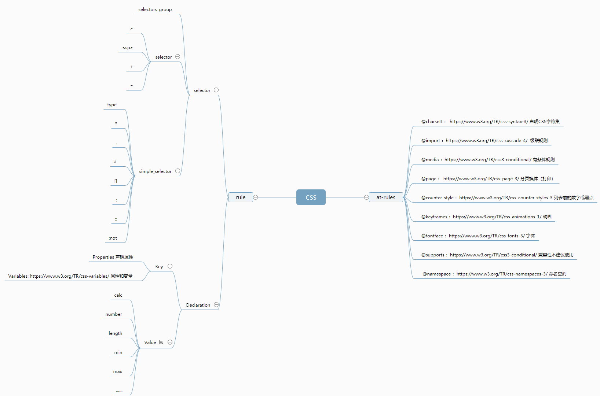

# Week6 学习笔记

- [Week6 学习笔记](#week6-%e5%ad%a6%e4%b9%a0%e7%ac%94%e8%ae%b0)
  - [CSS 总论 | CSS 语法的研究](#css-%e6%80%bb%e8%ae%ba--css-%e8%af%ad%e6%b3%95%e7%9a%84%e7%a0%94%e7%a9%b6)
    - [CSS2.1 语法](#css21-%e8%af%ad%e6%b3%95)
  - [CSS 总论 | CSS @规则的研究](#css-%e6%80%bb%e8%ae%ba--css-%e8%a7%84%e5%88%99%e7%9a%84%e7%a0%94%e7%a9%b6)
  - [CSS 总论 | CSS 规则的结构](#css-%e6%80%bb%e8%ae%ba--css-%e8%a7%84%e5%88%99%e7%9a%84%e7%bb%93%e6%9e%84)
  - [CSS 总论 | 收集标准](#css-%e6%80%bb%e8%ae%ba--%e6%94%b6%e9%9b%86%e6%a0%87%e5%87%86)
  - [CSS 总论 | CSS 总论总结](#css-%e6%80%bb%e8%ae%ba--css-%e6%80%bb%e8%ae%ba%e6%80%bb%e7%bb%93)
  - [CSS 选择器 | 选择器语法](#css-%e9%80%89%e6%8b%a9%e5%99%a8--%e9%80%89%e6%8b%a9%e5%99%a8%e8%af%ad%e6%b3%95)
  - [CSS 选择器 | 选择器的优先级](#css-%e9%80%89%e6%8b%a9%e5%99%a8--%e9%80%89%e6%8b%a9%e5%99%a8%e7%9a%84%e4%bc%98%e5%85%88%e7%ba%a7)
    - [简单选择器计数](#%e7%ae%80%e5%8d%95%e9%80%89%e6%8b%a9%e5%99%a8%e8%ae%a1%e6%95%b0)
  - [CSS 选择器 | 伪类](#css-%e9%80%89%e6%8b%a9%e5%99%a8--%e4%bc%aa%e7%b1%bb)
  - [CSS 选择器 | 伪元素](#css-%e9%80%89%e6%8b%a9%e5%99%a8--%e4%bc%aa%e5%85%83%e7%b4%a0)
    - [为什么 first-letter 可以设置 float 之类的，而 first-line 不行](#%e4%b8%ba%e4%bb%80%e4%b9%88-first-letter-%e5%8f%af%e4%bb%a5%e8%ae%be%e7%bd%ae-float-%e4%b9%8b%e7%b1%bb%e7%9a%84%e8%80%8c-first-line-%e4%b8%8d%e8%a1%8c)

## CSS 总论 | CSS 语法的研究

### CSS2.1 语法

当时的完整语法

- CSS
  - at-rules
    - @charset
    - @import
    - @media
    - @page
  - rule

---

## CSS 总论 | CSS @规则的研究

- CSS

  - at-rules
    - @charset
    - @import
    - @media - 重要
    - @page
    - @counter-style - 很少用
    - @keyframes - 重要
    - @fontface - 重要
    - @support - 不推荐，本身存在兼容性问题
    - @namespace - 很少用
  - rule

废弃或太新：

- @document
- @color-profile
- @font-feature

---

## CSS 总论 | CSS 规则的结构

重点在于 CSS 规则

结构：

- 选择器
- 声明
  - Key
  - Value

Selector:

- level 3 支持行较好
- level 4 还在标准制定中

Key：

- Properties
- Vairiables: --开头

---

## CSS 总论 | 收集标准

---

## CSS 总论 | CSS 总论总结

---

## CSS 选择器 | 选择器语法

简单选择器：

- \*
- div svg|a - 考虑 namespace
- .cls
- #id
- [attr=value]
- :hover
- ::before

复合选择器：

- <简单选择器><简单选择器><简单选择器>
- \* 或者 div 必须写在最前面

复杂选择器：

- <复合选择器>\<sp\><复合选择器>
- <复合选择器>">"<复合选择器>
- <复合选择器>"~"<复合选择器>
- <复合选择器>"+"<复合选择器>
- <复合选择器>"||"<复合选择器>

---

## CSS 选择器 | 选择器的优先级

### 简单选择器计数

Exp:

\#id div.a#id {}

[0, 2, 1, 1]

Specificity 计算：

- [0, 0, 0, 0] - [inline, id, class, tag] => 从左到右权重依次下降
- S = 0 \* N^3 + 2 \* N^2 + 1 \* N^1 + 1
- 假设取 N = 1000000
- S = 2000001000001

> 老版本 IE6 为节约内存占用，对 N 取值 256，值不够大，导致 256 个 class = 一个 id
> 当前大部分浏览器都选择 65536 以上的值

---

## CSS 选择器 | 伪类

链接/行为：

- :any-link
- :link :visited 注意：一旦使用了，就不能改变除了文字颜色之外的属性；因为比如改变了文字大小，就能用 JS 获取，就会泄露用户访问行为
- :hover
- :active
- :focus
- :target

树结构：

- :empty
- nth-child()
- nth-last-child()
- first-child :last-child :only-child

逻辑型：

- :not - 只支持复合选择器
- :where :has - CSS Level 4

> 注意： CSS 选择器不应该过于复杂，过于复杂的 CSS 选择器意味着 HTML 结构有问题，而很多问题是可以通过调正 HTML 结构和使用 class 来解决的

---

## CSS 选择器 | 伪元素

- ::before ::after - content 属性：通过选择器添加不存在的元素
- ::first-line - 根据排版之后的 first line
- ::first-letter

### 为什么 first-letter 可以设置 float 之类的，而 first-line 不行

- first-letter 是在布局完成之后，确定了一段文字中的第一个文字，可以对其操作布局时性能开销小；
- first-line 选中的是第一行文字，不同的宽度选中的文字内容不一样，要对其重新布局排版消耗性能大,所以 first-letter 可以设置 float 之类的，而 first-line 不行。
